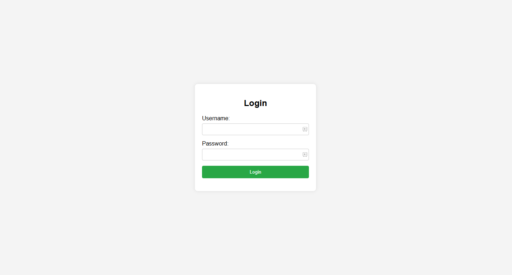

# Login-Form
A clean and responsive login form built using **HTML**, **CSS**, and **JavaScript**.  
# 📋 Login Form  

A clean and responsive login form built using **HTML**, **CSS**, and **JavaScript**.  



---
# 📋 Login Form live link

![Login Form live link] https://login-form-gamma-three.vercel.app/


---

## 🛠️ Technologies Used  

- **HTML**: For the structure of the page  
- **CSS**: For styling the components  
- **JavaScript**: For form validation or interactivity  

---

## 📸 Preview  

Below is a screenshot of the login form:  

  

---

## 🚀 How to Use  

1. Clone the repository:  
   ```bash
   git clone https://github.com/Mamunahmedoffical/login-form.git


---

## 🌟 Features  

- Simple and minimalist design  
- Fully responsive layout  
- Interactive login button  

---

## 🛠️ Technologies Used  

- **HTML**: For the structure of the page  
- **CSS**: For styling the components  
- **JavaScript**: For form validation or interactivity  

---

## 📸 Preview  

Below is a screenshot of the login form:  

  

---

## 🚀 How to Use  

1. Clone the repository:  
   ```bash
  https://github.com/Mamunahmedoffical/Login-Form
Navigate to the project folder:
bash
Copy
Edit
cd login-form
Open the index.html file in your browser.
🔧 Project Structure
bash
Copy
Edit
/project-folder  
│── index.html        # HTML file  
│── style.css         # CSS file  
│── script.js         # JavaScript file  
│── /assets           # Images or other assets  
🆓 Public Domain Dedication
This project is released into the public domain under the CC0 1.0 Universal (Public Domain Dedication) license.

You are free to:

Use this project for any purpose
Modify it
Distribute it
Perform and display it publicly
No attribution is required, but I’d love it if you mentioned me! 😊

✨ Author
👤 Mamun Ahmed
📧 Email: psmfarhan@gmail.com
🔗 GitHub: Mamunahmedoffical

🌟 License
CC0 1.0 Universal (Public Domain Dedication)

Feel free to use, modify, and distribute this project without any restrictions!


---

Let me know if you need further assistance or edits! 😊
